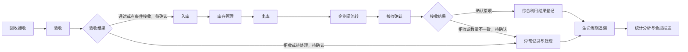

# C2-1 术语和业务事实盘点 V0.1

版本：V0.1  
阶段：C2 全局业务基线  
状态：待评审  
来源：C1 业务定位基线 V1.0、用户对 C2-1 的执行要求  
边界：本文只梳理术语、参与者职责和端到端业务主流程，不设计数据库、接口、页面、原型或代码。

## 1. 业务术语表 V0.1

| 编号 | 术语 | 当前定义 | 状态 | 待确认点 |
| --- | --- | --- | --- | --- |
| TERM-001 | 动力电池 | 本系统追溯和流转管理的核心对象之一，可指电池包、模组或单体电芯中的一种或多种。 | 待确认 | 系统最小追踪单位是电池包、模组还是单体电芯。 |
| TERM-002 | 电池包 | C1 已列入“动力电池或电池包”范围，可作为首期追踪对象候选。 | 待确认 | 是否作为系统默认最小追踪单位。 |
| TERM-003 | 电池唯一编号 | 用于识别单个追踪对象的业务标识。 | 待确认 | 编号由谁生成、何时生成、是否通过二维码识别。 |
| TERM-004 | 回收接收 | 企业接收外部或内部来源动力电池的业务活动。 | 待确认 | 接收时必须登记哪些来源信息。 |
| TERM-005 | 验收 | 对接收的动力电池进行业务确认，决定是否允许进入后续库存或处理流程。 | 待确认 | 验收结果集合和验收责任人。 |
| TERM-006 | 入库 | 验收后将动力电池纳入企业库存管理的业务活动。 | 待确认 | 入库前是否必须完成验收。 |
| TERM-007 | 库存 | 企业当前可管理、可追溯的动力电池或电池包存量。 | 待确认 | 库存状态、库存责任人和库存调整规则。 |
| TERM-008 | 出库 | 动力电池从企业库存中移出，用于企业间流转、综合利用或其他去向的业务活动。 | 待确认 | 出库是否需要审核和接收确认。 |
| TERM-009 | 企业间流转 | 动力电池在本企业与上下游协作企业之间发生转移的业务活动。 | 待确认 | 由哪一方创建流转单，哪一方确认接收。 |
| TERM-010 | 接收确认 | 流转接收方对到达对象、数量和状态进行确认的业务记录。 | 待确认 | 拒收或数量不一致时的处理方式。 |
| TERM-011 | 综合利用 | 对动力电池进行后续利用或处理结果登记的业务环节。 | 待确认 | 是否包含梯次利用、拆解、材料回收。 |
| TERM-012 | 生命周期追溯事件 | 记录动力电池从接收到利用全过程关键节点的事件。 | 待确认 | 追溯查询需要展示哪些节点和责任主体。 |
| TERM-013 | 异常记录 | 对接收、验收、库存、流转、接收确认或综合利用中发现的问题进行登记和处理的记录。 | 待确认 | 异常分类、处理责任和闭环条件。 |
| TERM-014 | 操作审计记录 | 对关键业务操作进行留痕的记录，用于追溯责任。 | 待确认 | 哪些记录生效后不能删除，只能撤销或更正。 |
| TERM-015 | 合规报送 | 面向监管或课程演示的汇总输出能力。 | 已确认部分 | 首期不连接真实监管平台；报表导出或模拟报送方式待确认。 |

## 2. 参与者及职责表 V0.1

| 编号 | 参与者 | 初步职责 | 状态 | 待确认点 |
| --- | --- | --- | --- | --- |
| ACT-001 | 回收操作员 | 登记回收接收信息，发起或维护回收批次相关记录。 | 待确认 | 具体登记字段、是否能发起验收。 |
| ACT-002 | 仓库管理员 | 处理入库、库存、出库等库存相关业务记录。 | 待确认 | 入库是否必须基于验收通过记录。 |
| ACT-003 | 流转管理员 | 管理企业间流转单、流转过程和接收确认协同。 | 待确认 | 流转单创建方、接收方确认规则。 |
| ACT-004 | 综合利用人员 | 登记综合利用结果。 | 待确认 | 综合利用包含哪些业务环节。 |
| ACT-005 | 业务主管 | 审核关键业务操作、处理异常升级事项。 | 待确认 | 哪些操作必须审核。 |
| ACT-006 | 系统管理员 | 管理用户、企业、角色、权限和系统基础配置。 | 待确认 | 权限粒度和角色配置方式。 |
| ACT-007 | 外部协作企业 | 作为企业间流转参与方，进行有限协同和接收确认。 | 待确认 | 是否登录系统、是否只能处理本企业相关流转。 |

## 3. 端到端业务主流程 V0.1

当前主流程只表达 C1 已确认范围内的业务顺序和协同关系，不代表数据库表、页面流程或接口流程。

## 4. 业务事实基线表达 V0.1

| 编号 | 谁 | 在什么条件下 | 对什么业务对象 | 执行什么活动 | 产生什么记录 | 状态变化 | 异常处理 |
| --- | --- | --- | --- | --- | --- | --- | --- |
| FACT-001 | 回收操作员 | 企业发生回收接收业务时 | 动力电池或电池包、回收批次 | 登记回收接收 | 回收批次、来源信息 | 待确认 | 来源信息缺失时如何处理待确认 |
| FACT-002 | 回收操作员或待确认角色 | 接收完成后 | 动力电池或电池包、验收记录 | 发起或执行验收 | 验收记录 | 待确认 | 验收结果集合待确认 |
| FACT-003 | 仓库管理员 | 验收满足入库条件后 | 动力电池或电池包、库存记录 | 办理入库 | 入库记录、库存记录 | 待确认 | 未验收或有条件接收是否可入库待确认 |
| FACT-004 | 仓库管理员 | 库存对象需要转出时 | 库存记录、出库记录 | 办理出库 | 出库记录 | 待确认 | 出库是否需要审核待确认 |
| FACT-005 | 流转管理员 | 发生企业间流转时 | 流转单、动力电池或电池包 | 创建并跟踪流转 | 流转单 | 待确认 | 创建方和责任边界待确认 |
| FACT-006 | 外部协作企业或流转接收方 | 流转对象到达后 | 接收确认记录、流转单 | 确认接收 | 接收确认记录 | 待确认 | 拒收或数量不一致处理待确认 |
| FACT-007 | 综合利用人员 | 电池进入综合利用环节后 | 综合利用记录、动力电池或电池包 | 登记综合利用结果 | 综合利用记录 | 待确认 | 综合利用范围待确认 |
| FACT-008 | 业务主管 | 发生需审核或异常升级事项时 | 异常记录、关键业务记录 | 审核或处理异常 | 审核记录、异常处理记录 | 待确认 | 必须审核的操作待确认 |
| FACT-009 | 相关业务角色 | 需要追溯查询时 | 生命周期追溯事件 | 查询全过程节点 | 查询结果或导出内容 | 不改变业务状态 | 展示节点和责任主体待确认 |
| FACT-010 | 管理人员或待确认角色 | 需要合规汇总时 | 统计数据、报送数据 | 导出报表或模拟报送 | 报表文件或模拟报送记录 | 不改变业务状态 | 首期报送方式待确认 |

## 5. 本轮待确认问题

| 编号 | 问题 | 影响范围 |
| --- | --- | --- |
| Q-C2-001 | 系统最小追踪单位是电池包、模组还是单体电芯？ | 影响追踪对象、编号、状态机和后续需求。 |
| Q-C2-002 | 电池唯一编号从哪里产生，是否通过二维码识别？ | 影响接收、追溯、审计和演示方式。 |
| Q-C2-003 | 回收接收时需要登记哪些来源信息？ | 影响回收接收事实和追溯节点。 |
| Q-C2-004 | 验收结果有哪些：通过、拒收、待处理，还是包含有条件接收？ | 影响验收状态和异常路径。 |
| Q-C2-005 | 入库前是否必须完成验收？ | 影响入库条件和业务规则。 |
| Q-C2-006 | 企业间流转由哪一方创建，哪一方确认接收？ | 影响流转职责和协同边界。 |
| Q-C2-007 | 对方拒收或实际数量不一致时如何处理？ | 影响异常流程和追溯记录。 |
| Q-C2-008 | 综合利用包括梯次利用、拆解、材料回收中的哪些环节？ | 影响综合利用范围。 |
| Q-C2-009 | 哪些操作必须由业务主管审核？ | 影响职责、权限和业务规则。 |
| Q-C2-010 | 哪些记录一旦生效就不能删除，只能撤销或更正？ | 影响审计、追溯和更正规则。 |
| Q-C2-011 | 合规报送首期采用报表导出还是模拟报送？ | 影响合规报送定位和演示交付。 |
| Q-C2-012 | 追溯查询需要展示哪些关键节点和责任主体？ | 影响追溯事件口径和展示内容。 |

## 6. C2-1 暂停点

C2-1 已完成术语、参与者职责和端到端主流程的 V0.1 盘点。下一步应先评审上述待确认问题，再继续定义核心业务对象关系、业务状态和详细业务规则。

暂停条件：不得自动进入数据库、接口、页面、原型或代码设计。
