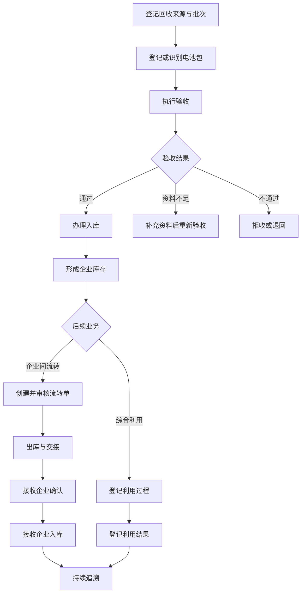

# C2 全局业务基线

## 1. 文档信息

| 项目   | 内容                        |
| ---- | ------------------------- |
| 文档名称 | C2 全局业务基线                 |
| 系统名称 | 面向动力电池回收利用企业的流转协同与追溯管理系统  |
| 文档版本 | V1.0                      |
| 当前阶段 | Global Business Baseline  |
| 当前关口 | C2                        |
| 上一基线 | C1 业务定位基线 V1.0            |
| 文档状态 | 已确认                       |
| 适用范围 | 软件工程课程项目                  |
| 特别说明 | 本文业务规则为系统设计基线，不作为真实监管法规解释 |

---

## 2. C2阶段目标

C2 阶段的目标，是在进入系统需求、原型、数据库和程序设计之前，建立统一、完整、可以追踪的业务基线。

本阶段需要回答：

1. 系统服务哪些业务参与者；
2. 参与者分别承担什么职责；
3. 动力电池回收和流转业务如何运行；
4. 系统管理哪些业务对象；
5. 业务对象之间有什么关系；
6. 电池和业务单据如何发生状态变化；
7. 哪些业务规则必须遵守；
8. 发生异常时如何处理；
9. 哪些工作由系统完成，哪些工作仍由人工完成；
10. 后续优先选择哪条业务流程进行纵向开发。

---

## 3. 业务定位

本系统面向动力电池回收利用企业，采用 PC Web 形式，为企业提供动力电池回收接收、验收、入库、库存、出库、企业间流转、综合利用、异常处理和生命周期追溯等业务管理能力。

系统以企业内部业务管理为主，同时支持有限的上下游企业流转协同。

系统不替代国家监管平台，不直接控制检测设备、仓储设备或拆解生产线。首期只提供企业业务记录、过程留痕、追溯查询、统计分析和模拟合规报送能力。

---

## 4. 系统业务范围

### 4.1 纳入范围

1. 企业、用户、角色和权限管理；
2. 动力电池及电池包基础档案；
3. 回收接收和来源登记；
4. 电池验收及验收结果记录；
5. 入库、库存、出库和库存台账；
6. 企业间流转申请、审核、出库和接收确认；
7. 综合利用结果登记；
8. 电池生命周期事件记录和追溯查询；
9. 业务异常登记、处理和关闭；
10. 业务统计、追溯统计和模拟合规报送；
11. 关键业务操作审计；
12. 数据导出和报表生成。

### 4.2 不纳入范围

1. 真实国家监管平台接口接入；
2. 真实物联网设备和检测设备控制；
3. 电池单体级别的精细追踪；
4. 拆解生产线自动控制；
5. 物流车辆实时定位；
6. 在线支付、采购和财务结算；
7. 面向公众开放的查询平台；
8. 移动端、小程序和 App；
9. 完整客户关系管理；
10. 法律法规自动判定；
11. 人工检测结果真实性鉴定；
12. 跨境流转和复杂国际业务。

---

## 5. 业务基本假设

| 编号     | 业务事实                     |
| ------ | ------------------------ |
| BF-001 | 系统以电池包作为最小独立追踪单位         |
| BF-002 | 模组和电芯只记录数量、类型或规格，首期不单独追踪 |
| BF-003 | 每个电池包必须具有系统内唯一追溯编码       |
| BF-004 | 系统追溯编码可以通过二维码展示和识别       |
| BF-005 | 电池验收通过后才能进入正常库存          |
| BF-006 | 企业间流转由转出企业发起，由接收企业确认     |
| BF-007 | 企业间转出需要经过业务主管审核          |
| BF-008 | 数量、编码或实物不一致时不能直接完成接收     |
| BF-009 | 已生效的业务记录不能直接删除           |
| BF-010 | 综合利用只登记处理结果，不控制实际生产线     |
| BF-011 | 首期采用文件导出和模拟报送，不连接真实监管平台  |
| BF-012 | 所有关键业务活动都应形成可查询的追溯事件     |

---

## 6. 业务术语表

| 术语     | 定义                                  |
| ------ | ----------------------------------- |
| 动力电池   | 为新能源汽车等设备提供动力来源的电池产品                |
| 电池包    | 由若干电池模组、电芯及管理部件组成的电池整体，本系统的最小独立追踪单位 |
| 电池追溯编码 | 系统为每个电池包建立的唯一业务标识                   |
| 原始编码   | 电池生产企业、上游企业或原系统提供的编码                |
| 二维码    | 用于展示或扫描电池追溯编码的识别载体                  |
| 回收接收   | 企业接收退役、废旧或待处理动力电池的业务活动              |
| 回收批次   | 同一次回收或交接业务中形成的一组电池集合                |
| 来源企业   | 向当前企业提供、移交或转出电池的企业                  |
| 验收     | 对电池身份、数量、外观、资料和基本情况进行核对并记录结果的业务活动   |
| 待补充资料  | 电池暂时不能通过验收，但可以通过补充资料继续处理的状态         |
| 入库     | 将验收通过的电池登记到指定仓库或库位的业务活动             |
| 库存     | 当前由企业负责管理、并处于仓储管理范围内的电池集合           |
| 出库     | 电池离开当前企业仓库的业务活动                     |
| 流转     | 电池在不同企业、仓库或业务环节之间发生转移的过程            |
| 流转单    | 记录转出企业、接收企业、电池明细及流转过程的业务单据          |
| 接收确认   | 接收企业核对流转信息和实物后，对接收结果进行确认的业务活动       |
| 综合利用   | 对回收电池进行梯次利用、拆解、材料回收或其他处置的业务活动       |
| 生命周期事件 | 电池从登记到综合利用全过程中发生的一次可追溯业务活动          |
| 追溯记录   | 按时间顺序保存的电池状态、位置、企业和业务操作记录           |
| 异常     | 业务执行过程中出现的编码、数量、状态、资料或权限等不一致情况      |
| 异常单    | 对异常问题进行登记、处理、审核和关闭的业务记录             |
| 业务更正   | 在保留原始记录的前提下，通过补充记录修正错误信息            |
| 撤销     | 对尚未完成或允许撤销的业务操作进行反向处理               |
| 模拟报送   | 按规定格式生成报送数据并记录报送状态，但不连接真实监管平台       |
| 业务基线   | 经确认后作为需求分析、设计、开发和测试依据的业务事实集合        |

---

## 7. 业务参与者及职责

### 7.1 内部业务角色

| 角色     | 主要职责                   | 允许进行的核心操作                |
| ------ | ---------------------- | ------------------------ |
| 回收操作员  | 登记回收来源、电池和批次信息，执行接收及验收 | 创建回收批次、登记电池、提交验收结果、补充资料  |
| 仓库管理员  | 管理电池入库、库存、出库及盘点        | 入库、出库、库存查询、盘点、登记库存异常     |
| 流转管理员  | 管理企业间电池流转              | 创建流转单、维护电池明细、提交审核、跟踪接收状态 |
| 综合利用人员 | 登记电池综合利用过程及结果          | 创建利用记录、登记利用类型、完成利用结果     |
| 业务主管   | 审核关键业务，查看统计和处理异常       | 审核流转、审核异常关闭、审核更正、审核模拟报送  |
| 系统管理员  | 管理用户、角色、权限和系统参数        | 用户管理、角色授权、企业配置、字典配置、日志查询 |

### 7.2 外部业务参与者

| 参与者    | 主要职责           | 系统处理方式                |
| ------ | -------------- | --------------------- |
| 来源企业   | 向当前企业提供或移交电池   | 首期作为业务资料登记，不要求直接登录    |
| 接收企业   | 接收当前企业转出的电池    | 可以使用协作企业账号或由本企业人员模拟确认 |
| 上下游协作方 | 提供交接、运输或业务协作信息 | 记录基本信息及关联单据           |
| 监管机构   | 接收企业报送的数据      | 首期不直接连接，只生成模拟报送文件     |
| 管理人员   | 查看业务进度、异常和统计情况 | 由业务主管角色承担             |

---

## 8. 端到端业务主流程

### 8.1 正常业务流程



### 8.2 回收接收流程

1. 回收操作员创建回收批次；
2. 登记来源企业、交接日期、交接地点和关联单据；
3. 扫描或输入电池原始编码；
4. 系统检查是否存在重复编码；
5. 不存在时建立电池档案和系统追溯编码；
6. 将电池加入回收批次；
7. 提交验收；
8. 形成待验收任务。

### 8.3 验收流程

1. 回收操作员选择待验收电池；
2. 核对编码、数量、来源和资料；
3. 登记基本验收信息；
4. 选择验收结果；
5. 验收通过后，电池进入“已验收待入库”状态；
6. 资料不足时进入“待补充资料”状态；
7. 验收不通过时进入“验收不通过”状态；
8. 系统生成验收追溯事件。

### 8.4 入库流程

1. 仓库管理员选择已验收待入库的电池；
2. 选择目标仓库和库位；
3. 系统检查电池是否已经在库；
4. 仓库管理员确认入库；
5. 系统生成库存记录和库存台账；
6. 电池状态变更为“在库”；
7. 系统生成入库追溯事件。

### 8.5 企业间流转流程

1. 流转管理员选择在库电池；
2. 创建流转单；
3. 选择接收企业；
4. 添加流转电池明细；
5. 提交流转审核；
6. 业务主管审核；
7. 审核通过后，仓库管理员办理出库；
8. 电池进入“流转中”状态；
9. 接收企业核对电池和单据；
10. 无异常时确认接收；
11. 电池归属转移至接收企业；
12. 接收企业办理入库；
13. 流转单完成；
14. 系统形成完整流转追溯记录。

### 8.6 综合利用流程

1. 综合利用人员选择在库电池；
2. 创建综合利用任务；
3. 选择利用类型；
4. 登记处理时间、处理方式和结果；
5. 确认利用完成；
6. 电池进入相应的生命周期完成状态；
7. 系统生成综合利用追溯事件。

### 8.7 异常处理流程

1. 系统校验或业务人员发现异常；
2. 创建异常单；
3. 异常关联电池、批次、流转单或业务记录；
4. 指定处理人员；
5. 登记原因和处理措施；
6. 必要时由业务主管审核；
7. 完成业务更正、重新交接或退回；
8. 关闭异常单；
9. 原始业务记录继续保留。

---

## 9. 核心业务对象

| 编号     | 业务对象   | 业务含义                     |
| ------ | ------ | ------------------------ |
| BO-001 | 企业     | 参与回收、流转、接收或综合利用的组织       |
| BO-002 | 用户     | 登录系统并执行业务操作的人员           |
| BO-003 | 角色     | 用户职责和权限的集合               |
| BO-004 | 电池包    | 系统最小独立追踪对象               |
| BO-005 | 回收批次   | 一次回收接收活动形成的电池集合          |
| BO-006 | 回收接收单  | 记录来源和交接信息的业务单据           |
| BO-007 | 验收记录   | 记录电池验收过程和结果              |
| BO-008 | 仓库     | 保存电池库存的业务地点              |
| BO-009 | 库位     | 仓库内存放电池的具体位置             |
| BO-010 | 入库单    | 记录电池进入仓库的业务单据            |
| BO-011 | 库存记录   | 记录电池当前库存位置和状态            |
| BO-012 | 出库单    | 记录电池离开仓库的业务单据            |
| BO-013 | 流转单    | 记录企业间电池转移过程              |
| BO-014 | 接收确认记录 | 接收企业对电池交接结果的确认           |
| BO-015 | 综合利用记录 | 记录电池利用类型、过程和结果           |
| BO-016 | 生命周期事件 | 表示电池发生的一次业务变化            |
| BO-017 | 异常单    | 记录异常发现、处理和关闭过程           |
| BO-018 | 报送批次   | 汇总一批需要模拟报送的数据            |
| BO-019 | 报送文件   | 系统生成的 Excel、CSV 或 PDF 文件 |
| BO-020 | 审计日志   | 记录关键系统操作和数据变更            |

---

## 10. 业务对象关系

| 主对象  | 关系      | 从对象       |
| ---- | ------- | --------- |
| 企业   | 拥有      | 用户        |
| 用户   | 被授予     | 角色        |
| 来源企业 | 对应多个    | 回收批次      |
| 回收批次 | 包含多个    | 电池包       |
| 电池包  | 对应多个    | 验收记录      |
| 电池包  | 对应多个    | 入库和出库记录   |
| 仓库   | 包含多个    | 库位        |
| 库位   | 存放多个    | 电池包       |
| 流转单  | 包含一个或多个 | 电池包       |
| 流转单  | 对应一个    | 转出企业      |
| 流转单  | 对应一个    | 接收企业      |
| 流转单  | 对应零个或多个 | 异常单       |
| 电池包  | 对应零个或多个 | 综合利用记录    |
| 电池包  | 对应多个    | 生命周期事件    |
| 异常单  | 关联一个或多个 | 业务对象或业务单据 |
| 报送批次 | 汇总多个    | 业务记录      |
| 用户   | 产生多个    | 审计日志      |

核心关系约束：

1. 一个电池包同一时刻只能归属于一个责任企业；
2. 一个电池包同一时刻只能存在于一个有效库位；
3. 一个电池包不能同时参加多个未完成流转；
4. 一个流转单只能有一个转出企业和一个接收企业；
5. 生命周期事件必须关联电池包和业务来源；
6. 业务更正不能覆盖或删除原始事件。

---

## 11. 电池包生命周期状态

| 状态编码   | 状态名称   | 含义              |
| ------ | ------ | --------------- |
| BAT-01 | 已登记    | 已建立电池档案，尚未完成验收  |
| BAT-02 | 待验收    | 已进入验收任务         |
| BAT-03 | 待补充资料  | 验收资料不足，等待补充     |
| BAT-04 | 验收不通过  | 当前验收未通过，不能入库    |
| BAT-05 | 已验收待入库 | 验收通过，等待办理入库     |
| BAT-06 | 在库     | 已进入企业库存         |
| BAT-07 | 待出库    | 已关联审核通过的流转或利用任务 |
| BAT-08 | 流转中    | 已出库，等待接收企业确认    |
| BAT-09 | 接收待入库  | 接收企业已确认，等待办理入库  |
| BAT-10 | 利用处理中  | 已进入综合利用业务       |
| BAT-11 | 已梯次利用  | 已完成梯次利用登记       |
| BAT-12 | 已拆解回收  | 已完成拆解或材料回收登记    |
| BAT-13 | 已其他处置  | 已完成其他处置登记       |

### 11.1 允许的主要状态转换

| 当前状态   | 触发活动    | 下一状态   | 触发角色   |
| ------ | ------- | ------ | ------ |
| 已登记    | 提交验收    | 待验收    | 回收操作员  |
| 待验收    | 资料不足    | 待补充资料  | 回收操作员  |
| 待补充资料  | 补充并重新提交 | 待验收    | 回收操作员  |
| 待验收    | 验收不通过   | 验收不通过  | 回收操作员  |
| 待验收    | 验收通过    | 已验收待入库 | 回收操作员  |
| 已验收待入库 | 办理入库    | 在库     | 仓库管理员  |
| 在库     | 流转审核通过  | 待出库    | 业务主管   |
| 待出库    | 办理出库    | 流转中    | 仓库管理员  |
| 流转中    | 接收确认    | 接收待入库  | 接收企业   |
| 接收待入库  | 办理入库    | 在库     | 仓库管理员  |
| 在库     | 启动综合利用  | 利用处理中  | 综合利用人员 |
| 利用处理中  | 完成梯次利用  | 已梯次利用  | 综合利用人员 |
| 利用处理中  | 完成拆解回收  | 已拆解回收  | 综合利用人员 |
| 利用处理中  | 完成其他处置  | 已其他处置  | 综合利用人员 |

禁止直接跳过验收、入库、审核或接收确认等必要业务节点。

---

## 12. 主要业务单据状态

### 12.1 验收记录状态

```text
草稿 → 待验收 → 验收通过
             ├→ 待补充资料 → 待验收
             └→ 验收不通过
```

### 12.2 流转单状态

```text
草稿 → 待审核 → 已审核 → 待出库 → 流转中 → 已接收 → 已完成
               └→ 审核驳回
流转中 → 异常处理中 → 流转中/已退回/已完成
```

### 12.3 异常单状态

```text
待处理 → 处理中 → 待审核 → 已关闭
                   └→ 退回处理
```

### 12.4 模拟报送状态

```text
草稿 → 已生成 → 待审核 → 已审核 → 已导出 → 模拟已报送
                        └→ 审核驳回
```

---

## 13. 业务规则

### 13.1 电池档案规则

| 编号     | 业务规则               |
| ------ | ------------------ |
| BR-001 | 每个电池包必须具有系统内唯一追溯编码 |
| BR-002 | 相同追溯编码不得重复建立有效档案   |
| BR-003 | 原始编码允许为空，但存在时应保留   |
| BR-004 | 电池档案必须记录当前责任企业     |
| BR-005 | 已参与业务的电池档案不能直接删除   |
| BR-006 | 二维码内容必须能够定位到唯一电池档案 |

### 13.2 回收和验收规则

| 编号     | 业务规则                 |
| ------ | -------------------- |
| BR-007 | 创建回收批次时必须登记来源类型和交接时间 |
| BR-008 | 一个回收批次至少包含一个电池包才能提交  |
| BR-009 | 重复编码电池不能直接加入新的有效批次   |
| BR-010 | 未完成登记的电池不能提交验收       |
| BR-011 | 验收必须给出明确结果           |
| BR-012 | 验收不通过的电池不能办理正常入库     |
| BR-013 | 待补充资料的电池必须补充后重新验收    |
| BR-014 | 验收结果变更必须保留原始记录和变更原因  |

### 13.3 仓储规则

| 编号     | 业务规则                  |
| ------ | --------------------- |
| BR-015 | 只有已验收待入库或接收待入库的电池才能入库 |
| BR-016 | 入库必须指定仓库和库位           |
| BR-017 | 同一电池不能同时存在于两个有效库位     |
| BR-018 | 已出库电池不得继续作为当前企业正常库存   |
| BR-019 | 出库必须关联有效业务单据          |
| BR-020 | 库存盘点差异必须登记异常          |
| BR-021 | 库存更正必须说明原因并保留调整记录     |

### 13.4 流转规则

| 编号     | 业务规则                   |
| ------ | ---------------------- |
| BR-022 | 只有在库电池才能加入流转单          |
| BR-023 | 一个流转单只能对应一个转出企业和一个接收企业 |
| BR-024 | 转出企业和接收企业不能相同          |
| BR-025 | 一个电池不能同时加入多个未完成流转单     |
| BR-026 | 流转单至少包含一个电池才能提交审核      |
| BR-027 | 未审核通过的流转单不能办理出库        |
| BR-028 | 出库后流转单进入流转中状态          |
| BR-029 | 接收企业必须核对电池编码和数量        |
| BR-030 | 编码或数量不一致时不能直接完成接收      |
| BR-031 | 接收确认后才能变更责任企业          |
| BR-032 | 接收后的电池必须办理入库才能进入正常库存   |
| BR-033 | 流转退回必须保留原流转记录和退回原因     |
| BR-034 | 已完成流转单不能直接修改核心业务信息     |

### 13.5 综合利用规则

| 编号     | 业务规则                  |
| ------ | --------------------- |
| BR-035 | 只有当前企业在库电池才能进入综合利用    |
| BR-036 | 综合利用必须登记利用类型和处理结果     |
| BR-037 | 已进入利用处理的电池不能同时发起企业间流转 |
| BR-038 | 利用完成后必须生成生命周期事件       |
| BR-039 | 已完成利用的电池不能再次作为正常库存流转  |
| BR-040 | 利用结果更正必须经过业务主管审核      |

### 13.6 异常和审计规则

| 编号     | 业务规则                         |
| ------ | ---------------------------- |
| BR-041 | 异常必须关联具体业务对象或业务单据            |
| BR-042 | 异常关闭前必须登记处理结果                |
| BR-043 | 关键异常关闭需要业务主管审核               |
| BR-044 | 已生效业务记录不得物理删除                |
| BR-045 | 更正记录必须能够追溯到原始记录              |
| BR-046 | 关键状态变化必须生成生命周期事件             |
| BR-047 | 用户、角色、审核、出入库、流转和更正操作必须记录审计日志 |
| BR-048 | 普通业务人员不能修改其他角色的权限            |
| BR-049 | 用户只能访问其被授权企业范围内的数据           |
| BR-050 | 模拟报送数据必须来源于已确认的业务记录          |

---

## 14. 异常类型及处理方式

| 编号     | 异常类型    | 触发条件           | 处理方式       | 关闭条件           |
| ------ | ------- | -------------- | ---------- | -------------- |
| EX-001 | 电池编码重复  | 登记时发现相同有效编码    | 停止登记，核对原档案 | 确认使用原档案或完成编码更正 |
| EX-002 | 来源信息缺失  | 缺少来源企业或交接信息    | 补充资料       | 必填信息完整         |
| EX-003 | 验收不通过   | 电池或资料不符合当前验收条件 | 拒收、退回或重新处理 | 已记录最终处理结果      |
| EX-004 | 待补充资料   | 验收资料不足         | 补充资料后重新验收  | 验收得到最终结果       |
| EX-005 | 重复入库    | 电池已有有效库存记录     | 停止入库并核对库存  | 消除重复记录         |
| EX-006 | 库存盘点差异  | 系统库存与实物不一致     | 创建盘点异常并调查  | 完成更正及主管审核      |
| EX-007 | 非法状态转换  | 操作与当前业务状态不匹配   | 系统拒绝操作     | 选择合法业务流程       |
| EX-008 | 流转数量不一致 | 发送数量与接收数量不一致   | 暂停接收并登记异常  | 双方确认更正或退回      |
| EX-009 | 流转编码不一致 | 接收电池编码不在流转单中   | 暂停接收并核对    | 编码核对完成         |
| EX-010 | 接收拒绝    | 接收方拒绝接收        | 登记原因并发起退回  | 电池退回或双方完成处理    |
| EX-011 | 长时间未接收  | 出库后超过约定时间未确认   | 提醒并登记待处理事项 | 已接收、退回或人工关闭    |
| EX-012 | 无权限操作   | 用户执行未授权操作      | 系统拒绝并记录日志  | 不需要业务关闭        |
| EX-013 | 已生效记录错误 | 发现正式记录内容错误     | 发起更正申请     | 更正通过审核并形成新记录   |
| EX-014 | 报送数据不完整 | 模拟报送缺少必要业务信息   | 阻止生成最终报送文件 | 数据补充完整         |
| EX-015 | 系统操作失败  | 保存、提交或状态更新失败   | 保持原状态并提示重试 | 操作成功或人工处理完成    |

---

## 15. 业务信息与追溯要求

每个电池包的追溯视图至少需要展示：

1. 系统追溯编码；
2. 原始编码；
3. 电池类型、规格和基本信息；
4. 当前责任企业；
5. 当前业务状态；
6. 当前仓库和库位；
7. 来源企业或来源类型；
8. 所属回收批次；
9. 验收时间和验收结果；
10. 每次入库和出库记录；
11. 企业间流转的转出方和接收方；
12. 流转申请、审核、出库和接收时间；
13. 综合利用类型和处理结果；
14. 关联异常记录；
15. 业务操作人员；
16. 关联业务单据；
17. 状态变化前值和后值；
18. 数据更正或撤销记录；
19. 生命周期事件时间线；
20. 关键操作审计信息。

---

## 16. 系统处理与人工处理边界

| 业务活动  | 系统负责           | 人工负责         |
| ----- | -------------- | ------------ |
| 电池识别  | 生成编码、查询档案、检查重复 | 扫码、核对实物      |
| 回收接收  | 保存来源、批次和交接信息   | 完成实际交接       |
| 电池验收  | 保存验收项目、结果和状态   | 判断电池实际情况     |
| 入库    | 校验状态、登记仓库和库存   | 搬运和放置电池      |
| 库存管理  | 维护台账、查询和统计     | 实物盘点         |
| 企业间流转 | 管理单据、审核、状态和追溯  | 实际运输和交接      |
| 接收确认  | 核对系统明细、保存结果    | 核对到货实物       |
| 综合利用  | 记录任务和结果        | 执行梯次利用、拆解或回收 |
| 异常处理  | 建立异常单、保存处理过程   | 调查原因和协商处理    |
| 合规报送  | 汇总数据、生成文件、记录状态 | 人工复核并提交外部平台  |
| 权限管理  | 执行授权和访问控制      | 管理人员决定授权范围   |
| 追溯查询  | 汇总并展示生命周期记录    | 使用者判断业务责任    |

---

## 17. 权限基本原则

1. 用户必须登录后才能访问业务数据；
2. 用户只能访问其所在企业或被授权企业的数据；
3. 不同岗位按角色分配权限；
4. 创建、审核和执行关键操作应尽量由不同角色完成；
5. 普通业务人员不能修改用户角色和权限；
6. 系统管理员负责技术性管理，不代替业务主管审批业务；
7. 已生效业务记录更正需要业务主管审核；
8. 关键操作必须记录用户、时间、对象和结果；
9. 未授权操作应被拒绝；
10. 权限变化应保留审计记录。

---

## 18. 统计与管理指标

| 指标      | 业务含义             |
| ------- | ---------------- |
| 回收批次数量  | 指定时间范围内登记的回收批次数  |
| 回收电池数量  | 指定范围内接收的电池包数量    |
| 验收通过率   | 验收通过数量占完成验收数量的比例 |
| 待验收数量   | 尚未得到验收结果的电池数量    |
| 待补充资料数量 | 处于资料补充状态的电池数量    |
| 当前库存数量  | 企业当前有效库存中的电池数量   |
| 入库数量    | 指定时间范围内完成入库的电池数量 |
| 出库数量    | 指定时间范围内完成出库的电池数量 |
| 流转完成率   | 已完成流转单占已发起流转单的比例 |
| 待接收流转数量 | 已出库但尚未完成接收确认的数量  |
| 异常数量    | 指定范围内产生的异常总数     |
| 异常关闭率   | 已关闭异常占全部异常的比例    |
| 综合利用数量  | 已进入或完成综合利用的电池数量  |
| 追溯完整率   | 具备必要业务节点记录的电池占比  |
| 模拟报送数量  | 已生成或已导出的模拟报送批次数  |

具体指标目标值不在 C2 阶段设定，后续在系统需求和验收标准阶段确定。

---

## 19. 功能域初步划分

该划分只用于表达业务结构，不代表页面、数据库或程序模块设计。

| 功能域     | 主要业务职责           |
| ------- | ---------------- |
| 企业与权限管理 | 企业、用户、角色和数据权限    |
| 电池档案管理  | 电池登记、编码、查询和基础信息  |
| 回收接收管理  | 来源登记、批次管理和回收交接   |
| 验收管理    | 验收任务、验收结果和资料补充   |
| 仓储库存管理  | 入库、库存、出库和盘点      |
| 流转协同管理  | 流转申请、审核、交接和接收确认  |
| 综合利用管理  | 梯次利用、拆解和材料回收结果登记 |
| 生命周期追溯  | 业务事件时间线和追溯查询     |
| 异常管理    | 异常登记、处理、审核和关闭    |
| 统计报送管理  | 统计分析、文件导出和模拟报送   |
| 系统审计管理  | 操作日志、变更记录和系统字典   |

---

## 20. 第一条纵向业务切片候选

### 20.1 候选切片

**回收接收 → 电池登记 → 验收 → 入库 → 库存可见**

### 20.2 选择理由

1. 是整个系统的业务起点；
2. 能形成完整的输入、处理和结果闭环；
3. 涉及多个业务角色；
4. 可以验证电池唯一编码；
5. 可以验证状态转换；
6. 可以验证业务规则；
7. 可以验证追溯事件；
8. 不依赖真实外部监管平台；
9. 不依赖企业间真实协作；
10. 适合课程项目首先实现和演示。

### 20.3 切片包含的角色

* 回收操作员；
* 仓库管理员；
* 业务主管；
* 系统管理员。

### 20.4 切片包含的核心对象

* 企业；
* 用户和角色；
* 电池包；
* 回收批次；
* 回收接收单；
* 验收记录；
* 仓库和库位；
* 入库单；
* 库存记录；
* 生命周期事件；
* 异常单；
* 审计日志。

### 20.5 切片暂不包含

* 企业间实际协作账号；
* 真实物流运输；
* 综合利用生产过程；
* 真实监管接口；
* 面向公众的追溯查询；
* 移动端扫码应用。

该切片在 C2 中只作为候选，进入 C3 后再详细定义范围、场景和验收条件。

---

## 21. 非阻断性待确认事项

以下内容不影响 C2 全局业务基线确认，可以在后续阶段逐步确定：

1. 电池基础信息的最终字段清单；
2. 验收项目及具体判定标准；
3. 仓库和库位编码规则；
4. 流转超时的具体时间；
5. 模拟报送文件的最终格式；
6. 统计指标的目标值；
7. 是否设置独立的外部协作企业账号；
8. 是否需要支持批量导入电池档案；
9. 是否需要打印二维码标签；
10. 是否需要上传交接凭证和检测附件。

这些内容不得在未确认时被描述为行业强制要求。

---

## 22. C2一致性检查

| 检查项           | 结果 |
| ------------- | -- |
| 系统业务定位与 C1 一致 | 通过 |
| 系统范围和边界明确     | 通过 |
| 业务术语具有统一定义    | 通过 |
| 业务参与者及职责明确    | 通过 |
| 端到端业务流程完整     | 通过 |
| 核心业务对象已识别     | 通过 |
| 业务对象关系无明显冲突   | 通过 |
| 电池生命周期状态已定义   | 通过 |
| 业务状态转换具有触发条件  | 通过 |
| 核心业务规则已编号     | 通过 |
| 主要异常具有处理方式    | 通过 |
| 系统与人工处理边界明确   | 通过 |
| 追溯信息要求明确      | 通过 |
| 第一条纵向业务切片已提出  | 通过 |
| 未进入数据库设计      | 通过 |
| 未进入接口设计       | 通过 |
| 未进入页面和原型设计    | 通过 |
| 未进入程序代码设计     | 通过 |

---

## 23. C2关口结论

本文件已经建立动力电池回收、验收、仓储、流转、综合利用、异常处理和追溯业务的全局业务基线。

C2 确认后：

1. 本文升级为“已确认”状态；
2. `C2` 记录为已完成关口；
3. 当前阶段进入纵向业务切片定义；
4. 当前关口变更为 `C3`；
5. 后续只详细设计第一条纵向业务切片；
6. 仍不能直接开始完整数据库和前后端开发；
7. 只有 C3 切片范围和验收条件确认后，才进入对应原型和系统需求设计。

---

## 24. C2确认声明

确认以下内容作为本项目的全局业务基线 V1.0：

* 项目业务范围与边界；
* 业务术语；
* 业务参与者及职责；
* 端到端业务流程；
* 核心业务对象及关系；
* 电池及业务单据状态；
* 50条业务规则；
* 15类主要异常；
* 系统处理与人工处理边界；
* 追溯信息要求；
* 统计指标定义；
* 第一条纵向业务切片候选。

确认人：用户确认
确认日期：2026-09-16
确认结果：通过

---

