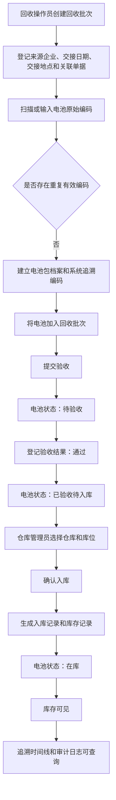

# C3 第一条业务切片定义 V0.1

文档名称：C3 第一条业务切片定义  
系统名称：面向动力电池回收利用企业的流转协同与追溯管理系统  
切片名称：回收接收 -> 电池登记 -> 验收 -> 入库 -> 库存可见  
当前阶段：first-business-slice  
当前关口：C3  
文档状态：待评审  
输入基线：C1 业务定位基线 V1.0、C2 全局业务基线 V1.0  
边界说明：本文只定义业务切片范围、流程、规则、状态、用例和验收标准，不设计数据库、API、页面视觉或代码。

## 1. 切片目标与业务价值

### 1.1 切片目标

本切片将 C2 中提出的第一条纵向业务切片细化为一条可理解、可评审、可验收的业务闭环：

1. 回收操作员创建回收批次并登记来源信息。
2. 回收操作员扫描或输入电池编码，建立电池包追溯档案。
3. 系统检查重复编码，阻止重复建立有效档案。
4. 回收操作员将电池加入回收批次并提交验收。
5. 回收操作员登记验收结果。
6. 仓库管理员对验收通过的电池办理入库。
7. 系统形成库存记录、生命周期事件和关键操作审计日志。
8. 业务人员可以查询当前库存并查看电池追溯时间线。

### 1.2 业务价值

| 编号 | 价值 | 说明 |
| --- | --- | --- |
| VALUE-001 | 建立追溯起点 | 从回收接收开始生成电池包追溯档案和生命周期事件。 |
| VALUE-002 | 保证对象唯一 | 通过唯一追溯编码和重复编码检查，避免一物多档。 |
| VALUE-003 | 打通入库闭环 | 从回收接收到验收入库形成库存可见的最小业务闭环。 |
| VALUE-004 | 支撑后续流转 | 入库后的有效库存可作为后续企业间流转和综合利用的前置基础。 |
| VALUE-005 | 支撑课程验收 | 可验证角色、规则、状态、异常、追溯、审计和验收标准之间的追踪关系。 |

## 2. 切片范围和排除范围

### 2.1 包含范围

| 编号 | 范围项 | 来源 |
| --- | --- | --- |
| IN-001 | 创建回收批次 | C2 8.2、BR-007、BR-008 |
| IN-002 | 登记回收来源 | C2 8.2、EX-002 |
| IN-003 | 扫描或输入电池编码 | C2 8.2、BF-004、BR-006 |
| IN-004 | 建立电池档案 | C2 BO-004、BR-001、BR-004 |
| IN-005 | 检查重复编码 | C2 BR-002、BR-009、EX-001 |
| IN-006 | 将电池加入回收批次 | C2 BO-005、BR-008 |
| IN-007 | 提交验收 | C2 BAT-01 -> BAT-02 |
| IN-008 | 登记验收结果 | C2 BR-011、BR-012、BR-013、BR-014 |
| IN-009 | 补充资料后重新验收 | C2 BAT-03 -> BAT-02、EX-004 |
| IN-010 | 验收通过后办理入库 | C2 BR-015、BR-016 |
| IN-011 | 选择仓库和库位 | C2 BO-008、BO-009、BR-016 |
| IN-012 | 生成库存记录 | C2 BO-011、BR-017 |
| IN-013 | 查询当前库存 | C2 16 系统处理边界、18 统计指标 |
| IN-014 | 查看电池追溯时间线 | C2 15 业务信息与追溯要求 |
| IN-015 | 记录关键操作审计日志 | C2 BR-047、权限基本原则 |

### 2.2 排除范围

| 编号 | 排除项 | 说明 |
| --- | --- | --- |
| OUT-001 | 企业间流转 | C3 本切片只到库存可见，不进入流转单、出库和接收确认。 |
| OUT-002 | 接收企业确认 | 属于后续流转协同切片。 |
| OUT-003 | 综合利用 | 属于后续综合利用切片。 |
| OUT-004 | 模拟合规报送 | 属于统计报送或合规汇总能力。 |
| OUT-005 | 完整统计分析 | 本切片只要求库存可查询，不定义指标目标值。 |
| OUT-006 | 真实二维码硬件 | 只定义扫码或输入编码的业务能力，不绑定真实硬件。 |
| OUT-007 | 真实检测设备 | 验收结果由人工判断并录入，系统不控制检测设备。 |
| OUT-008 | 数据库表设计 | C3 不设计表结构、字段类型、索引或迁移脚本。 |
| OUT-009 | API 设计 | C3 不定义接口路径、请求响应或协议。 |
| OUT-010 | 页面视觉设计 | C3 不定义页面布局、组件或视觉样式。 |
| OUT-011 | 前后端代码 | C3 不生成实现代码。 |

## 3. 参与角色和职责

| 角色 | 本切片职责 | 不负责内容 |
| --- | --- | --- |
| 回收操作员 | 创建回收批次、登记来源信息、录入或扫描电池编码、建立电池档案、提交验收、登记验收结果、补充资料后重新验收。 | 不办理入库，不管理权限，不审核业务更正。 |
| 仓库管理员 | 对已验收待入库的电池选择仓库和库位，确认入库，查询库存。 | 不修改验收结果，不绕过验收入库。 |
| 业务主管 | 查看关键异常、处理越权或更正类事项；本切片首次评审阶段只定义其监督职责。 | 不代替普通操作员创建回收批次。 |
| 系统管理员 | 管理用户、角色和权限，使不同角色只能执行被授权操作。 | 不代替业务主管审批业务。 |

待确认：业务主管在本切片中是否需要审核“验收结果更正”或“已生效记录撤销”。C2 已要求更正保留原因并形成审计，但具体审批触发点可在 C4 验收标准细化。

## 4. 前置条件与结束条件

### 4.1 前置条件

| 编号 | 前置条件 | 状态 |
| --- | --- | --- |
| PRE-001 | C1 业务定位基线已确认。 | 已确认 |
| PRE-002 | C2 全局业务基线已确认。 | 已确认 |
| PRE-003 | 系统以电池包作为最小独立追踪单位。 | 已确认 |
| PRE-004 | 回收操作员、仓库管理员、业务主管、系统管理员等角色存在。 | 已确认 |
| PRE-005 | 企业、用户、角色、权限、仓库、库位等基础资料可被业务引用。 | 待确认，C2 已定义对象，具体基础资料初始化方式未确定。 |
| PRE-006 | 电池包系统追溯编码需要唯一。 | 已确认 |

### 4.2 结束条件

| 编号 | 结束条件 | 判断方式 |
| --- | --- | --- |
| END-001 | 电池包完成登记并具有唯一系统追溯编码。 | 存在有效电池档案。 |
| END-002 | 验收结果为通过的电池进入“已验收待入库”。 | 状态转换符合 BAT-02 -> BAT-05。 |
| END-003 | 已验收待入库的电池完成入库后进入“在库”。 | 状态转换符合 BAT-05 -> BAT-06。 |
| END-004 | 形成有效库存记录，且能在当前库存中查询。 | 业务查询能定位该电池包。 |
| END-005 | 生命周期时间线包含登记、提交验收、验收结果、入库等关键事件。 | 追溯事件完整。 |
| END-006 | 关键操作形成审计日志。 | 审计记录包含操作人、时间、对象和结果。 |

## 5. 正常业务流程



## 6. 异常流程

### 6.1 重复编码

| 项目 | 内容 |
| --- | --- |
| 触发条件 | 登记电池时发现相同系统追溯编码或相同有效原始编码已经存在。 |
| 引用规则 | BR-002、BR-009、EX-001 |
| 系统处理 | 阻止直接建立新的有效档案，提示核对原档案或进行编码更正。 |
| 业务结果 | 电池不能加入新的有效回收批次，除非完成核对或更正。 |
| 待确认 | 原始编码重复但实物确认为不同电池时，是否允许生成新的系统追溯编码并保留重复原因。 |

### 6.2 来源信息缺失

| 项目 | 内容 |
| --- | --- |
| 触发条件 | 创建回收批次时缺少来源类型、来源企业、交接时间或其他必填来源信息。 |
| 引用规则 | BR-007、EX-002 |
| 系统处理 | 不允许提交验收，要求补充必要来源信息。 |
| 业务结果 | 回收批次保持草稿或待补充状态。 |
| 待确认 | 来源企业、交接地点、关联单据、交接人是否均为必填。 |

### 6.3 资料不足

| 项目 | 内容 |
| --- | --- |
| 触发条件 | 验收时资料不足，但仍可通过补充资料继续处理。 |
| 引用规则 | BR-013、EX-004 |
| 系统处理 | 验收结果登记为待补充资料，电池状态变为 BAT-03 待补充资料。 |
| 业务结果 | 补充资料后可以重新提交验收，状态回到 BAT-02 待验收。 |
| 待确认 | 资料不足的具体资料类型和补充时限。 |

### 6.4 验收不通过

| 项目 | 内容 |
| --- | --- |
| 触发条件 | 电池或资料不符合当前验收条件。 |
| 引用规则 | BR-011、BR-012、EX-003 |
| 系统处理 | 记录验收不通过结果，电池状态变为 BAT-04 验收不通过。 |
| 业务结果 | 不能办理正常入库，需要拒收、退回或重新处理。 |
| 待确认 | 验收不通过后是否允许重新发起验收，及需要哪些审批。 |

### 6.5 入库资料不完整

| 项目 | 内容 |
| --- | --- |
| 触发条件 | 仓库管理员入库时未指定有效仓库或库位。 |
| 引用规则 | BR-016、EX-007 |
| 系统处理 | 阻止完成入库。 |
| 业务结果 | 电池保持“已验收待入库”。 |
| 待确认 | 仓库和库位编码规则。 |

### 6.6 越权操作

| 项目 | 内容 |
| --- | --- |
| 触发条件 | 用户执行未授权操作，例如回收操作员直接办理入库，普通业务人员修改权限。 |
| 引用规则 | BR-047、BR-048、BR-049、EX-012 |
| 系统处理 | 拒绝操作并记录审计日志。 |
| 业务结果 | 原业务状态不变。 |
| 待确认 | 本切片内每个操作的最终权限矩阵。 |

### 6.7 已生效记录删除或更正

| 项目 | 内容 |
| --- | --- |
| 触发条件 | 用户尝试删除已生效的回收、验收、入库、库存或追溯事件记录。 |
| 引用规则 | BR-005、BR-014、BR-044、BR-045、EX-013 |
| 系统处理 | 阻止直接物理删除，要求通过撤销或更正记录处理。 |
| 业务结果 | 原始记录继续保留，形成更正链。 |
| 待确认 | 哪些更正必须由业务主管审核。 |

## 7. 涉及的业务对象

| 编号 | 业务对象 | 本切片用途 | C2 来源 |
| --- | --- | --- | --- |
| BO-001 | 企业 | 表示当前责任企业、来源企业。 | C2 BO-001 |
| BO-002 | 用户 | 执行业务操作并形成审计记录。 | C2 BO-002 |
| BO-003 | 角色 | 控制回收操作员、仓库管理员等职责边界。 | C2 BO-003 |
| BO-004 | 电池包 | 本切片最小追踪对象。 | C2 BO-004 |
| BO-005 | 回收批次 | 聚合同一次回收接收的电池包。 | C2 BO-005 |
| BO-006 | 回收接收单 | 记录来源和交接信息。 | C2 BO-006 |
| BO-007 | 验收记录 | 记录验收过程和结果。 | C2 BO-007 |
| BO-008 | 仓库 | 入库目标地点。 | C2 BO-008 |
| BO-009 | 库位 | 入库目标位置。 | C2 BO-009 |
| BO-010 | 入库单 | 记录电池进入仓库。 | C2 BO-010 |
| BO-011 | 库存记录 | 支撑库存可见。 | C2 BO-011 |
| BO-016 | 生命周期事件 | 记录登记、验收、入库等关键状态变化。 | C2 BO-016 |
| BO-017 | 异常单 | 记录重复编码、资料缺失、非法状态等异常。 | C2 BO-017 |
| BO-020 | 审计日志 | 记录关键操作和越权操作。 | C2 BO-020 |

## 8. 涉及的状态转换

### 8.1 电池包生命周期状态

| 编号 | 当前状态 | 触发活动 | 下一状态 | 触发角色 | 验收关注 |
| --- | --- | --- | --- | --- | --- |
| ST-001 | 无档案 | 建立电池档案 | BAT-01 已登记 | 回收操作员 | 追溯编码唯一。 |
| ST-002 | BAT-01 已登记 | 提交验收 | BAT-02 待验收 | 回收操作员 | 来源信息和登记信息完整。 |
| ST-003 | BAT-02 待验收 | 资料不足 | BAT-03 待补充资料 | 回收操作员 | 不能入库，可补充资料。 |
| ST-004 | BAT-03 待补充资料 | 补充并重新提交 | BAT-02 待验收 | 回收操作员 | 形成补充资料事件。 |
| ST-005 | BAT-02 待验收 | 验收不通过 | BAT-04 验收不通过 | 回收操作员 | 不能正常入库。 |
| ST-006 | BAT-02 待验收 | 验收通过 | BAT-05 已验收待入库 | 回收操作员 | 可进入入库流程。 |
| ST-007 | BAT-05 已验收待入库 | 办理入库 | BAT-06 在库 | 仓库管理员 | 生成库存记录和入库事件。 |

### 8.2 验收记录状态

```text
草稿 -> 待验收 -> 验收通过
                -> 待补充资料 -> 待验收
                -> 验收不通过
```

## 9. 引用的 C2 业务规则

| 规则编号 | 规则摘要 | 本切片使用方式 |
| --- | --- | --- |
| BR-001 | 每个电池包必须具有系统内唯一追溯编码。 | 建立电池档案。 |
| BR-002 | 相同追溯编码不得重复建立有效档案。 | 重复编码检查。 |
| BR-003 | 原始编码允许为空，但存在时应保留。 | 电池登记。 |
| BR-004 | 电池档案必须记录当前责任企业。 | 追溯和库存归属。 |
| BR-005 | 已参与业务的电池档案不能直接删除。 | 已生效记录保护。 |
| BR-006 | 二维码内容必须能够定位到唯一电池档案。 | 编码展示或识别。 |
| BR-007 | 创建回收批次时必须登记来源类型和交接时间。 | 回收接收。 |
| BR-008 | 一个回收批次至少包含一个电池包才能提交。 | 提交验收前校验。 |
| BR-009 | 重复编码电池不能直接加入新的有效批次。 | 重复编码异常。 |
| BR-010 | 未完成登记的电池不能提交验收。 | 提交验收前校验。 |
| BR-011 | 验收必须给出明确结果。 | 验收记录。 |
| BR-012 | 验收不通过的电池不能办理正常入库。 | 入库前校验。 |
| BR-013 | 待补充资料的电池必须补充后重新验收。 | 资料不足异常。 |
| BR-014 | 验收结果变更必须保留原始记录和变更原因。 | 更正追溯。 |
| BR-015 | 只有已验收待入库或接收待入库的电池才能入库。 | 入库前校验。 |
| BR-016 | 入库必须指定仓库和库位。 | 入库条件。 |
| BR-017 | 同一电池不能同时存在于两个有效库位。 | 库存唯一位置。 |
| BR-041 | 异常必须关联具体业务对象或业务单据。 | 异常单。 |
| BR-044 | 已生效业务记录不得物理删除。 | 删除保护。 |
| BR-045 | 更正记录必须能够追溯到原始记录。 | 更正链。 |
| BR-046 | 关键状态变化必须生成生命周期事件。 | 追溯事件。 |
| BR-047 | 用户、角色、审核、出入库、流转和更正操作必须记录审计日志。 | 审计日志。 |
| BR-048 | 普通业务人员不能修改其他角色的权限。 | 越权操作。 |
| BR-049 | 用户只能访问其被授权企业范围内的数据。 | 数据权限。 |

## 10. 详细用例

| 用例编号 | 用例名称 | 主要参与者 | 前置条件 | 基本流程 | 异常分支 | 后置结果 |
| --- | --- | --- | --- | --- | --- | --- |
| UC-C3-001 | 创建回收批次 | 回收操作员 | 回收操作员已登录且有权限。 | 登记来源企业、来源类型、交接日期、交接地点、关联单据，保存回收批次。 | 来源信息缺失时不能提交。 | 形成回收批次草稿或有效批次。 |
| UC-C3-002 | 登记电池并建立档案 | 回收操作员 | 回收批次存在。 | 扫描或输入原始编码，系统检查重复，生成系统追溯编码，建立电池包档案。 | 重复编码时阻止直接建档。 | 电池状态为已登记。 |
| UC-C3-003 | 将电池加入回收批次 | 回收操作员 | 电池档案有效且未加入其他有效接收批次。 | 将电池包加入当前回收批次。 | 重复加入或无效档案时拒绝。 | 回收批次包含至少一个电池包。 |
| UC-C3-004 | 提交验收 | 回收操作员 | 批次来源信息完整，至少包含一个电池包。 | 提交验收，生成待验收任务。 | 缺少必要信息时不能提交。 | 电池状态变为待验收。 |
| UC-C3-005 | 登记验收通过 | 回收操作员 | 电池处于待验收。 | 登记验收结果为通过。 | 验收结果为空时不能保存最终结果。 | 电池状态变为已验收待入库。 |
| UC-C3-006 | 登记资料不足并重新验收 | 回收操作员 | 电池处于待验收。 | 登记资料不足，补充资料后重新提交验收。 | 未补充资料不能重新提交。 | 电池可回到待验收并重新给出结果。 |
| UC-C3-007 | 登记验收不通过 | 回收操作员 | 电池处于待验收。 | 登记验收不通过和原因。 | 无原因时是否允许提交待确认。 | 电池状态为验收不通过，不能入库。 |
| UC-C3-008 | 办理入库 | 仓库管理员 | 电池处于已验收待入库。 | 选择仓库和库位，确认入库。 | 未指定仓库库位、状态不合法或越权时拒绝。 | 生成入库记录、库存记录，电池状态变为在库。 |
| UC-C3-009 | 查询库存和追溯时间线 | 仓库管理员、业务主管 | 电池已入库。 | 查询库存，查看电池追溯时间线。 | 无权限时拒绝并记录日志。 | 可看到当前库存和生命周期事件。 |
| UC-C3-010 | 拒绝越权操作 | 系统管理员配置的普通用户 | 用户无对应操作权限。 | 用户尝试执行非授权操作。 | 系统拒绝操作。 | 原状态不变，形成审计日志。 |

## 11. Given/When/Then 验收标准

### AC-001 创建包含完整来源信息的回收批次

```gherkin
场景：创建包含完整来源信息的回收批次
Given 回收操作员已经登录并具有创建回收批次权限
When 回收操作员填写来源企业、来源类型、交接日期、交接地点和关联单据并保存
Then 系统生成回收批次
And 回收批次记录来源信息
And 系统记录创建人和创建时间
```

### AC-002 为新电池建立唯一追溯档案

```gherkin
场景：为新电池建立唯一追溯档案
Given 回收批次已经创建
And 输入的电池编码不存在有效档案
When 回收操作员登记电池信息
Then 系统建立电池包档案
And 系统生成系统内唯一追溯编码
And 电池状态为“已登记”
And 生命周期时间线增加登记事件
```

### AC-003 重复电池编码被系统阻止

```gherkin
场景：重复电池编码被系统阻止
Given 系统中已经存在相同有效电池编码
When 回收操作员尝试使用该编码登记新电池
Then 系统拒绝直接建立新的有效档案
And 系统提示核对原档案或进行编码更正
And 电池不能加入新的有效回收批次
```

### AC-004 缺少必要信息时不能提交验收

```gherkin
场景：缺少必要信息时不能提交验收
Given 回收批次缺少来源企业或交接时间
Or 回收批次不包含任何电池包
When 回收操作员提交验收
Then 系统拒绝提交
And 系统提示需要补充缺失信息
And 批次内电池状态不变
```

### AC-005 验收通过后进入已验收待入库

```gherkin
场景：验收通过后进入已验收待入库
Given 电池已经完成登记
And 电池当前状态为“待验收”
When 回收操作员登记验收结果为“通过”
Then 系统生成验收记录
And 电池状态变更为“已验收待入库”
And 生命周期时间线增加验收通过事件
```

### AC-006 资料不足时进入待补充资料

```gherkin
场景：资料不足时进入待补充资料
Given 电池当前状态为“待验收”
When 回收操作员登记验收结果为“资料不足”
Then 系统生成验收记录
And 电池状态变更为“待补充资料”
And 系统记录需要补充资料的说明
```

### AC-007 补充资料后可以重新提交验收

```gherkin
场景：补充资料后可以重新提交验收
Given 电池当前状态为“待补充资料”
When 回收操作员补充资料并重新提交验收
Then 电池状态变更为“待验收”
And 生命周期时间线增加资料补充事件
And 系统保留前一次资料不足记录
```

### AC-008 验收不通过的电池不能入库

```gherkin
场景：验收不通过的电池不能入库
Given 电池验收结果为“不通过”
And 电池当前状态为“验收不通过”
When 仓库管理员尝试办理入库
Then 系统拒绝入库
And 系统提示验收不通过不能办理正常入库
And 不生成有效库存记录
```

### AC-009 未指定仓库和库位时不能完成入库

```gherkin
场景：未指定仓库和库位时不能完成入库
Given 电池当前状态为“已验收待入库”
When 仓库管理员未选择有效仓库或库位并确认入库
Then 系统拒绝完成入库
And 电池状态保持“已验收待入库”
And 不生成有效库存记录
```

### AC-010 入库后电池状态变为在库

```gherkin
场景：验收通过的电池办理入库
Given 电池已经完成登记
And 电池验收结果为“通过”
And 电池当前状态为“已验收待入库”
When 仓库管理员选择有效仓库和库位并确认入库
Then 系统生成入库记录
And 系统生成有效库存记录
And 电池状态变更为“在库”
And 生命周期时间线增加一条入库事件
And 系统记录操作人员和操作时间
```

### AC-011 入库后可以在库存中查询到电池

```gherkin
场景：入库后可以在库存中查询到电池
Given 电池已经完成入库
And 电池状态为“在库”
When 仓库管理员按追溯编码查询库存
Then 系统返回该电池库存记录
And 结果显示当前责任企业、仓库、库位和状态
```

### AC-012 所有关键状态变化形成追溯事件

```gherkin
场景：关键状态变化形成追溯事件
Given 电池完成登记、提交验收、验收通过和入库
When 用户查看电池生命周期时间线
Then 时间线包含登记事件、提交验收事件、验收通过事件和入库事件
And 每条事件包含操作人、操作时间、业务单据和状态变化
```

### AC-013 越权操作被拒绝并记录日志

```gherkin
场景：越权操作被拒绝并记录日志
Given 用户不具备办理入库权限
When 该用户尝试对已验收待入库电池确认入库
Then 系统拒绝操作
And 电池状态不变
And 系统记录越权操作审计日志
```

### AC-014 已生效记录不能直接删除

```gherkin
场景：已生效记录不能直接删除
Given 回收批次、验收记录或入库记录已经生效
When 用户尝试直接删除该记录
Then 系统拒绝物理删除
And 系统提示应通过撤销或更正流程处理
And 原始记录继续保留
```

## 12. 需求、规则、状态和验收标准追踪矩阵

| 业务需求编号 | 业务需求 | C2 规则 | 状态转换 | 验收标准 | 用例 |
| --- | --- | --- | --- | --- | --- |
| BSR-C3-001 | 创建回收批次并登记来源信息 | BR-007、BR-008 | 无 | AC-001、AC-004 | UC-C3-001 |
| BSR-C3-002 | 为新电池建立唯一追溯档案 | BR-001、BR-003、BR-004、BR-006、BR-046 | ST-001 | AC-002、AC-012 | UC-C3-002 |
| BSR-C3-003 | 阻止重复编码建立有效档案 | BR-002、BR-009、EX-001 | 无 | AC-003 | UC-C3-002 |
| BSR-C3-004 | 将电池加入回收批次并提交验收 | BR-008、BR-010 | ST-002 | AC-004、AC-012 | UC-C3-003、UC-C3-004 |
| BSR-C3-005 | 登记验收通过 | BR-011、BR-014、BR-046 | ST-006 | AC-005、AC-012 | UC-C3-005 |
| BSR-C3-006 | 处理资料不足并支持重新验收 | BR-013、EX-004、BR-046 | ST-003、ST-004 | AC-006、AC-007、AC-012 | UC-C3-006 |
| BSR-C3-007 | 阻止验收不通过电池入库 | BR-012、EX-003 | ST-005 | AC-008 | UC-C3-007 |
| BSR-C3-008 | 对已验收待入库电池办理入库 | BR-015、BR-016、BR-017、BR-046 | ST-007 | AC-009、AC-010、AC-011、AC-012 | UC-C3-008、UC-C3-009 |
| BSR-C3-009 | 权限控制和越权审计 | BR-047、BR-048、BR-049、EX-012 | 无 | AC-013 | UC-C3-010 |
| BSR-C3-010 | 已生效记录保护和更正追溯 | BR-005、BR-014、BR-044、BR-045、EX-013 | 无 | AC-014 | UC-C3-010 |

## 13. C3 待确认问题

| 编号 | 问题 | 影响范围 |
| --- | --- | --- |
| Q-C3-001 | 电池基础信息的最终字段清单是什么？ | 影响 C4 需求规格、原型字段和验收用例。 |
| Q-C3-002 | 验收项目及具体判定标准是什么？ | 影响验收记录、验收结果说明和异常判断。 |
| Q-C3-003 | 仓库和库位编码规则是什么？ | 影响入库选择、库存查询和追溯展示。 |
| Q-C3-004 | 是否需要上传交接凭证和检测附件？ | 影响回收来源资料和资料不足分支。 |
| Q-C3-005 | 是否需要打印二维码标签？ | 影响 C4 原型和后续实现范围，但不影响 C3 业务闭环确认。 |

## 14. C3 检查清单

| 检查项 | 结果 | 说明 |
| --- | --- | --- |
| 切片目标与业务价值明确 | 通过 | 已说明该切片是追溯起点和库存可见闭环。 |
| 范围和排除范围明确 | 通过 | 已明确不进入流转、综合利用、报送、数据库、API、页面或代码。 |
| 参与角色和职责明确 | 通过 | 已覆盖回收操作员、仓库管理员、业务主管、系统管理员。 |
| 前置条件与结束条件明确 | 通过 | 已说明 C1/C2 基线、电池包追踪单位和库存可见终点。 |
| 正常流程闭环 | 通过 | 已覆盖创建批次、登记电池、验收、入库、库存查询、追溯。 |
| 异常流程覆盖 | 通过 | 已覆盖重复编码、资料缺失、资料不足、验收不通过、入库信息缺失、越权、删除保护。 |
| 业务对象明确 | 通过 | 已引用 C2 BO-001 至 BO-020 中本切片涉及对象。 |
| 状态转换明确 | 通过 | 已覆盖 BAT-01 至 BAT-06 的关键转换。 |
| 引用 C2 规则 | 通过 | 已列出本切片引用的 C2 规则。 |
| 详细用例明确 | 通过 | 已定义 UC-C3-001 至 UC-C3-010。 |
| 验收标准明确 | 通过 | 已定义 AC-001 至 AC-014。 |
| 追踪关系明确 | 通过 | 已建立业务需求、规则、状态、验收标准和用例关系。 |
| 未进入数据库设计 | 通过 | 未定义表结构或字段类型。 |
| 未进入 API 设计 | 通过 | 未定义接口。 |
| 未进入页面视觉设计 | 通过 | 未定义页面或组件。 |
| 未进入代码设计 | 通过 | 未生成前后端代码。 |

## 15. C3 暂停点

本文件已完成第一条业务切片 V0.1 定义，状态为待评审。  
下一步应先确认切片流程、异常分支、状态转换和验收标准是否一致。  
在用户明确确认 C3 前，不得更新 `completed_gate` 为 `C3`，不得进入 C4 原型与系统需求验证阶段。
