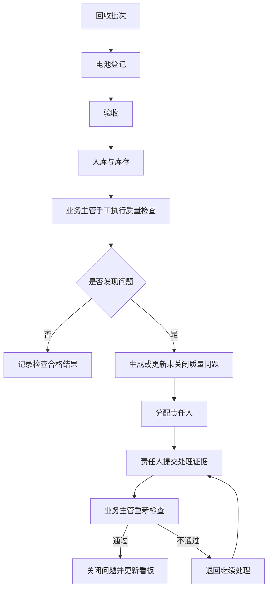

# 数据治理第一切片 V0.2

文档状态：修改后复核
关联变更：CR-DG-001
目标基线：V1.1

## 1. 切片定位

数据治理第一切片不替代原有业务第一切片。原业务切片继续负责产生回收接收、电池登记、验收、入库和库存可见的业务数据；治理切片在这些业务数据之上执行质量检查、生成质量问题、推动处理复核并更新质量看板。

DQ-004、DQ-005 等规则虽然在原业务流程中已有实时阻断校验，但治理规则定位为对已落库数据进行事后核对，用于发现历史数据、导入数据、异常写入或人工更正造成的不一致，不能取代原来的实时阻断校验。

## 2. 治理子切片流程

```text
固定规则及数据标准元数据
-> 手工质量检查
-> 发现问题或确认无问题
-> 生成质量问题并去重
-> 分配责任人
-> 责任人处理
-> 提交处理
-> 重新检查
-> 关闭或退回
-> 质量状态汇总看板
```

## 3. 业务与治理集成流程



## 4. 参与角色和职责

| 角色 | 数据治理职责 |
| --- | --- |
| 系统管理员 | 查看、启用和停用固定质量规则；启停必须填写原因并审计；不能修改规则算法、字段或判断表达式。 |
| 业务主管 | 手工发起检查，查看结果，分配责任人，重新检查，关闭问题，查看质量看板。 |
| 回收操作员 | 处理电池登记、原始编码核实、核心字段补充等登记类质量问题。 |
| 仓库管理员 | 处理仓库、库位、库存责任企业等库存类质量问题。 |

第一版不新增“数据治理专员”和通用“管理人员”。质量看板由业务主管查看，系统管理员具备只读查看权限。

## 5. 第一版质量规则

DQ-001 至 DQ-007 进入 V1.1 第一版需求草案；DQ-008 延期，不进入第一版。

| 编号 | 名称 | 维度 | 检查对象 | 参与字段 | 适用范围 | 检查条件 | 通过条件 | 失败条件 | 严重程度 | 默认责任角色 | 整改方式 | 重新检查方式 | 允许豁免 |
| --- | --- | --- | --- | --- | --- | --- | --- | --- | --- | --- | --- | --- | --- |
| DQ-001 | 系统追溯编码必须唯一 | 唯一性 | 电池档案 | system_trace_code、enterprise_id | 当前企业电池档案 | 同一企业内按系统追溯编码分组统计 | 每个追溯编码只对应一条有效电池档案 | 同一追溯编码存在多条有效档案 | 严重 | 业务主管 | 通过业务更正保留一条有效档案并记录原因 | 重新统计追溯编码唯一性 | 否 |
| DQ-002 | 电池核心字段必须完整 | 完整性 | 电池档案 | battery_type、battery_chemistry、lifecycle_status、responsible_enterprise_id | 当前企业有效电池档案 | 检查核心字段是否为空 | 必填核心字段均有值，其中电池体系允许为“未知” | 任一核心字段为空 | 一般 | 回收操作员 | 补充字段或提交无法补充说明 | 重新读取电池档案字段 | 否 |
| DQ-003 | 原始编码重复必须完成核实 | 一致性 | 电池档案和候选登记 | original_code、candidate_status、duplicate_review_status | 存在原始编码的电池档案和候选记录 | 检查重复原始编码是否存在未完成核实 | 重复原始编码均有关联核实结果 | 重复原始编码存在未核实候选 | 严重 | 回收操作员 | 完成同一电池或不同电池核实并记录原因 | 重新读取候选登记和核实记录 | 否 |
| DQ-004 | 未验收通过的电池不能入库 | 合法性 | 入库记录和电池档案 | battery_id、acceptance_status、battery_status、inbound_status | 当前企业入库记录 | 检查入库记录关联电池的验收结论和入库前状态 | 入库电池验收通过且入库前为已验收待入库 | 未通过、待补充资料或无验收结论的电池存在入库记录 | 严重 | 业务主管 | 发起业务更正或撤销错误入库记录，保留原记录 | 重新读取验收记录和入库记录 | 否 |
| DQ-005 | 库位必须属于所选仓库 | 一致性 | 入库记录 | warehouse_id、location_id | 当前企业入库记录 | inbound_record.location_id 对应库位的 warehouse_id 必须等于 inbound_record.warehouse_id | 两者相等且库位存在 | 两者不相等或库位不存在 | 严重 | 仓库管理员 | 通过库存调整或入库更正记录修正库位关系 | 重新读取入库记录、仓库和库位关系 | 否 |
| DQ-006 | 生命周期事件时间不能倒序 | 时序一致性 | 生命周期事件 | battery_id、event_time、event_type | 当前企业电池生命周期事件 | 按电池和事件时间排序检查关键事件顺序 | 事件时间符合登记、验收、入库等顺序 | 后置业务事件早于前置事件 | 一般 | 业务主管 | 发起事件时间更正说明并保留审计 | 重新读取生命周期事件顺序 | 是，需业务主管说明 |
| DQ-007 | 当前库存责任企业必须一致 | 一致性 | 库存记录和电池档案 | inventory.enterprise_id、battery.responsible_enterprise_id、inventory_status | 当前企业有效库存 | 检查在库记录责任企业与电池当前责任企业 | 两者一致 | 两者不一致 | 严重 | 仓库管理员 | 通过库存或责任企业调整记录处理 | 重新读取库存和电池责任企业 | 否 |

延期规则：

| 编号 | 规则 | 延期原因 |
| --- | --- | --- |
| DQ-008 | 已过期临时附件不能绑定 | 属于附件生命周期治理，待 V1.1 技术设计评估后再决定是否纳入后续版本。 |

## 6. 最小治理闭环

1. 系统管理员查看初始化质量规则。
2. 业务主管发起质量检查。
3. 系统生成检查结果。
4. 违规数据生成质量问题。
5. 业务主管分配责任人。
6. 责任人提交处理说明或数据更正结果。
7. 业务主管重新检查。
8. 问题满足关闭条件后关闭。
9. 数据质量看板更新。

## 7. 质量问题状态机

正常路径：

```text
OPEN -> ASSIGNED -> PROCESSING -> SUBMITTED -> RECHECKING -> CLOSED
```

失败路径：

```text
RECHECKING -> REJECTED -> PROCESSING -> SUBMITTED
```

| 状态 | 说明 |
| --- | --- |
| `OPEN` | 检查发现问题，尚未分配。 |
| `ASSIGNED` | 已分配责任人。 |
| `PROCESSING` | 责任人处理中。 |
| `SUBMITTED` | 责任人已提交处理说明或更正结果。 |
| `RECHECKING` | 业务主管重新检查。 |
| `CLOSED` | 复核通过并关闭。 |
| `REJECTED` | 复核未通过，退回继续处理。 |

状态规则：

- 检查发现问题后生成 `OPEN`。
- 未分配问题不能提交处理。
- 业务主管分配责任人后进入 `ASSIGNED`。
- 责任人开始处理后进入 `PROCESSING`。
- 非责任人不能提交处理。
- 没有处理说明或更正证据不能提交。
- 提交处理后进入 `SUBMITTED`。
- 非 `SUBMITTED` 状态不能重新检查。
- 重新检查开始时进入 `RECHECKING`。
- 重新检查通过后进入 `CLOSED`。
- 重新检查失败后进入 `REJECTED`。
- `REJECTED` 可以重新处理，重新处理后进入 `PROCESSING`。
- 已关闭问题不能再次编辑。
- 同一规则、同一对象已有未关闭问题时，重复检查不能反复创建相同问题。
- 已关闭后再次违反规则，可以创建新问题。

## 8. 问题关闭条件

质量问题必须同时满足以下条件才能关闭：

- 有处理说明。
- 有更正记录、附件或明确的无法更正说明作为整改证据。
- 同一规则、同一对象重新检查通过。
- 业务主管执行复核并确认关闭。
- 审计记录包含操作者、时间、对象、前后状态、处理结果和原因。

## 9. 看板指标口径

| 指标 | 计算口径 |
| --- | --- |
| 规则数量 | 当前企业启用规则数。 |
| 检查次数 | 默认最近 30 天内状态为 `COMPLETED` 的检查任务数；检查失败不计入。 |
| 问题数量 | 默认最近 30 天内发现的问题数。 |
| 未关闭问题 | 状态不为 `CLOSED` 的问题数。 |
| 关闭率 | 已关闭问题数 / 已发现问题总数。 |

所有指标按企业隔离。V1.1 第一版不提供趋势图，仅展示质量状态汇总。豁免问题如后续启用，默认不计入关闭率分子，需单独统计。

## 10. 排除范围

- 不建设数据湖、大数据平台或复杂元数据平台。
- 不做独立数据标准管理平台。
- 不做自动血缘解析。
- 不做 AI 自动修复。
- 不接入区块链或真实监管平台。
- 不开放自定义脚本规则引擎。
- 不允许治理流程直接物理覆盖原始业务记录。

## 11. 当前结论

本切片为 V0.2 修改后复核稿。CR-DG-001 尚未批准，不得进入 V1.1 技术设计确认，不得创建正式实现分支，不得编写生产业务代码。
