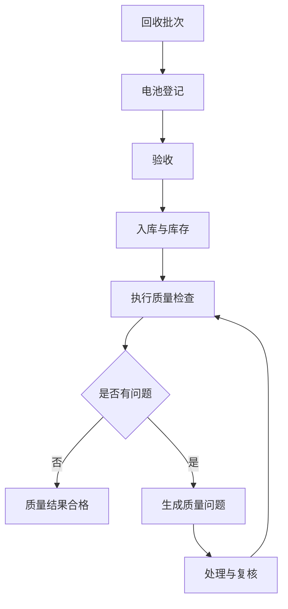

# 数据治理第一切片 V0.1

文档状态：待评审
关联变更：CR-DG-001
目标基线：V1.1

## 1. 切片定位

数据治理第一切片不替代原有业务第一切片。原业务切片继续负责产生回收接收、电池登记、验收、入库和库存可见的业务数据；治理切片在这些业务数据之上执行质量检查、生成质量问题、推动处理复核并更新质量看板。

## 2. 治理子切片流程

```text
质量规则
-> 数据检查
-> 发现问题
-> 分配责任人
-> 提交处理
-> 重新检查
-> 关闭问题
-> 质量看板
```

## 3. 业务与治理集成流程



## 4. 参与角色和职责

| 角色 | 数据治理职责 |
| --- | --- |
| 回收操作员 | 保证登记数据完整，按要求补充登记类问题说明。 |
| 仓库管理员 | 处理库存、仓库和库位相关质量问题。 |
| 业务主管 | 作为数据质量责任人，执行检查、分配问题、复核处理结果并关闭问题。 |
| 系统管理员 | 管理初始化质量规则和基础数据，不在第一版开放任意脚本规则。 |
| 管理人员 | 查看数据质量看板和质量趋势。 |

第一版暂不新增“数据治理专员”角色。

## 5. 候选质量规则

以下规则是候选范围，尚未确认进入 V1.1 基线。

| 编号 | 规则 | 维度 | 候选状态 |
| --- | --- | --- | --- |
| DQ-001 | 系统追溯编码必须唯一 | 唯一性 | 待确认 |
| DQ-002 | 电池核心字段必须完整 | 完整性 | 待确认 |
| DQ-003 | 原始编码重复必须完成核实 | 一致性 | 待确认 |
| DQ-004 | 未验收通过的电池不能入库 | 合法性 | 待确认 |
| DQ-005 | 库位必须属于所选仓库 | 一致性 | 待确认 |
| DQ-006 | 生命周期事件时间不能倒序 | 时序一致性 | 待确认 |
| DQ-007 | 当前库存责任企业必须一致 | 一致性 | 待确认 |
| DQ-008 | 已过期临时附件不能绑定 | 有效性 | 待确认 |

## 6. 最小治理闭环

1. 系统管理员查看初始化质量规则。
2. 业务主管发起质量检查。
3. 系统生成检查结果。
4. 违规数据生成质量问题。
5. 业务主管分配责任人。
6. 责任人提交处理说明或数据更正结果。
7. 业务主管重新检查。
8. 问题满足关闭条件后关闭。
9. 数据质量看板更新。

## 7. 质量问题状态

| 状态 | 说明 |
| --- | --- |
| `OPEN` | 检查发现问题，尚未分配。 |
| `ASSIGNED` | 已分配责任人。 |
| `PROCESSING` | 责任人处理中。 |
| `SUBMITTED` | 责任人已提交处理说明或更正结果。 |
| `RECHECKING` | 业务主管重新检查。 |
| `CLOSED` | 复核通过并关闭。 |
| `REJECTED` | 复核未通过，退回继续处理。 |

## 8. 排除范围

- 不建设数据湖、大数据平台或复杂元数据平台。
- 不做自动血缘解析。
- 不做 AI 自动修复。
- 不接入区块链或真实监管平台。
- 不开放自定义脚本规则引擎。
- 不允许治理流程直接物理覆盖原始业务记录。

## 9. 待确认问题

| 问题 | 状态 |
| --- | --- |
| 谁负责配置质量规则？ | 待确认 |
| 谁负责处理质量问题？ | 待确认 |
| 质量检查是实时还是手工执行？ | 待确认 |
| 哪些质量规则进入第一版？ | 待确认 |
| 错误数据是否允许直接修改？ | 待确认 |
| 问题达到什么条件才能关闭？ | 待确认 |
