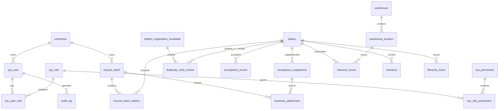

# 第一切片数据库设计 V0.1

文档名称：第一切片数据库设计  
系统名称：面向动力电池回收利用企业的流转协同与追溯管理系统  
当前阶段：system-design  
当前检查点：设计评审  
文档状态：待评审  
数据库：MySQL 8  
输入基线：C4 第一切片需求与原型基线 V1.0

## 1. 设计目标

本数据库设计支撑第一切片“回收接收 -> 电池登记 -> 验收 -> 入库 -> 库存可见”。设计重点是业务事实留痕、状态一致性、企业数据隔离、并发控制、唯一性约束、追溯事件和审计记录。

## 2. 设计原则

- 所有业务主表使用 `BIGINT` 主键。
- 所有企业内业务数据包含 `enterprise_id`。
- 业务可变表包含 `version` 乐观锁字段。
- 已生效验收、入库、生命周期事件和审计日志不得物理删除。
- `system_trace_code` 全局唯一。
- `original_code` 不设置唯一约束，只建立查询索引。
- 疑似重复原始编码先进入候选登记，不直接创建第二份有效电池档案。
- 单个电池同一时间只能存在一条有效当前库存。
- 写接口幂等处理必须持久化。
- 状态变更、业务记录和生命周期事件必须在同一事务中提交。
- 失败操作不得改变业务状态。

## 3. 核心表

| 表 | 用途 | 主要需求 |
| --- | --- | --- |
| `enterprise` | 企业信息 | 企业数据范围 |
| `sys_user` | 用户 | 登录、操作人、权限 |
| `sys_role` | 角色 | 角色权限矩阵 |
| `sys_permission` | 权限 | 权限编码 |
| `sys_user_role` | 用户角色关系 | 权限判断 |
| `sys_role_permission` | 角色权限关系 | 权限判断 |
| `recycle_batch` | 回收批次 | FR-C4-001..003、009、010 |
| `battery` | 电池档案 | FR-C4-004..008 |
| `battery_registration_candidate` | 电池登记候选 | FR-C4-006、007 |
| `recycle_batch_battery` | 批次与电池关系 | FR-C4-008..010 |
| `duplicate_code_review` | 原始编码人工核实 | FR-C4-006、007 |
| `acceptance_record` | 验收记录 | FR-C4-011、012、014 |
| `acceptance_supplement` | 验收补充资料 | FR-C4-013 |
| `warehouse` | 仓库 | FR-C4-016 |
| `warehouse_location` | 库位 | FR-C4-016 |
| `inbound_record` | 入库记录 | FR-C4-017 |
| `inventory` | 当前库存 | FR-C4-017、018 |
| `lifecycle_event` | 生命周期事件 | FR-C4-019 |
| `audit_log` | 安全及操作审计 | FR-C4-020、022 |
| `idempotency_record` | 幂等请求记录 | 写接口幂等和重复提交控制 |
| `business_attachment` | 业务附件元数据 | 来源、验收、补充资料附件 |

## 4. ER 图

## 5. 关键约束

| 约束 | 实现 |
| --- | --- |
| 系统追溯编码全局唯一 | `battery.system_trace_code` 唯一索引。 |
| 原始编码可重复 | `battery.original_code` 普通索引，不做唯一约束。 |
| 疑似重复不建有效档案 | 重复原始编码先写入 `battery_registration_candidate`，核实为不同电池后才创建 `battery`。 |
| 批次编号唯一 | `recycle_batch.batch_no` 唯一索引。 |
| 批次至少一个有效电池 | 由提交批次事务校验，不用数据库静态约束表达。 |
| 未核实疑似重复不能提交 | `battery.duplicate_status` 与服务层提交校验共同保证。 |
| 验收记录防重复 | 不使用永久 `UNIQUE(battery_id)`；通过电池状态条件更新、乐观锁和幂等键防止重复验收。 |
| 入库防重复 | 不使用永久 `UNIQUE(inbound_record.battery_id)`；通过电池状态条件更新、幂等键和当前库存唯一约束防止重复入库。 |
| 当前库存唯一 | `inventory.current_battery_id` 生成列唯一索引。 |
| 幂等键唯一 | `idempotency_record` 对企业、操作人、操作编码和幂等键建立唯一约束。 |
| 临时附件绑定 | `business_attachment.binding_status` 区分 `TEMP` 和 `BOUND`；临时附件不带业务对象，绑定后必须写入 `object_type/object_id`。 |
| 仓库库位归属 | `warehouse_location.warehouse_id` 外键。 |
| 企业数据范围 | 业务查询必须带 `enterprise_id`，核心表建立企业索引。 |
| 已生效记录保护 | 关键业务表不提供物理删除接口，数据库保留审计和事件。 |

## 6. 状态字段

| 表 | 字段 | 允许值 |
| --- | --- | --- |
| `recycle_batch` | `batch_status` | `DRAFT`、`PENDING_ACCEPTANCE`、`ACCEPTANCE_PROCESSING`、`COMPLETED` |
| `battery` | `lifecycle_status` | `REGISTERED`、`PENDING_ACCEPTANCE`、`ACCEPTED_PENDING_INBOUND`、`PENDING_SUPPLEMENT`、`ACCEPTANCE_REJECTED`、`IN_STOCK` |
| `battery` | `duplicate_status` | `NORMAL`、`SUSPECTED_DUPLICATE`、`RESOLVED_SAME`、`RESOLVED_DIFFERENT` |
| `battery_registration_candidate` | `candidate_status` | `PENDING_REVIEW`、`CLOSED_SAME`、`CLOSED_DIFFERENT`、`CANCELLED` |
| `acceptance_record` | `acceptance_result` | `PASS`、`NEED_SUPPLEMENT`、`REJECT` |
| `warehouse` | `enabled_status` | `ENABLED`、`DISABLED` |
| `warehouse_location` | `enabled_status` | `ENABLED`、`DISABLED` |
| `inventory` | `is_current` | `1` 当前有效、`0` 历史无效 |
| `lifecycle_event` | `event_result` | `SUCCESS`、`FAILED` |
| `audit_log` | `result` | `SUCCESS`、`FAILED`、`FORBIDDEN` |
| `idempotency_record` | `process_status` | `PROCESSING`、`SUCCEEDED`、`FAILED` |
| `business_attachment` | `binding_status` | `TEMP`、`BOUND` |

## 7. 索引设计

| 表 | 索引 | 用途 |
| --- | --- | --- |
| `battery` | `uk_battery_trace_code(system_trace_code)` | 全局追溯编码唯一。 |
| `battery` | `idx_battery_original_code(original_code)` | 原始编码重复检查。 |
| `battery` | `idx_battery_enterprise_status(enterprise_id, lifecycle_status)` | 待验收、待入库和库存查询。 |
| `battery_registration_candidate` | `idx_candidate_original_code(enterprise_id, original_code, candidate_status)` | 候选重复核实查询。 |
| `recycle_batch` | `uk_recycle_batch_no(batch_no)` | 批次编号唯一。 |
| `recycle_batch` | `idx_batch_enterprise_status(enterprise_id, batch_status)` | 批次列表和状态筛选。 |
| `recycle_batch_battery` | `uk_batch_battery(batch_id, battery_id)` | 防止同一电池重复加入同一批次。 |
| `acceptance_record` | `idx_acceptance_battery(battery_id, created_at)` | 验收历史查询。 |
| `inventory` | `uk_inventory_current_battery(current_battery_id)` | 单电池唯一当前库存。 |
| `lifecycle_event` | `idx_event_battery_time(battery_id, occurred_at)` | 追溯时间线。 |
| `audit_log` | `idx_audit_operator_time(operator_user_id, operated_at)` | 审计查询。 |
| `idempotency_record` | `uk_idempotency_record(enterprise_id, operator_user_id, operation_code, idempotency_key)` | 幂等记录唯一。 |
| `business_attachment` | `idx_attachment_temp_expires(binding_status, expires_at)` | 临时附件过期清理。 |

## 8. 生效记录保护策略

第一切片不实现完整更正和撤销流程，但必须阻止物理删除或直接覆盖已生效记录。后续实现时：

- `acceptance_record`、`inbound_record`、`lifecycle_event`、`audit_log` 不提供物理删除接口。
- 业务更正进入后续阶段，新增更正记录并保留原记录。
- 删除请求统一返回 `EFFECTIVE_RECORD_DELETE_FORBIDDEN` 并写入 `audit_log`。
- 对可编辑草稿数据，可使用 `deleted_at` 或状态作逻辑删除；本切片核心生效记录不依赖逻辑删除表达业务更正。

## 9. 事务设计

| 事务 | 涉及表 | 一致性要求 |
| --- | --- | --- |
| 提交批次 | `recycle_batch`、`battery`、`recycle_batch_battery`、`lifecycle_event`、`audit_log` | 整体校验通过后同时更新批次和电池状态；任一电池无效则全部回滚。 |
| 保存验收 | `acceptance_record`、`battery`、`recycle_batch`、`lifecycle_event`、`audit_log` | 验收记录、状态变化、批次完成判定和事件原子提交。 |
| 补充资料 | `acceptance_supplement`、`battery`、`lifecycle_event`、`audit_log` | 补充资料保存和状态恢复原子提交。 |
| 办理入库 | `inbound_record`、`inventory`、`battery`、`lifecycle_event`、`audit_log` | 入库记录、库存记录和电池在库状态原子提交。 |
| 幂等写接口 | `idempotency_record` 与目标业务表 | 成功时业务数据和 `SUCCEEDED` 在同一事务提交；业务失败时主事务回滚，再用独立事务记录 `FAILED`；系统异常留下 `PROCESSING` 时按过期策略允许重试。 |
| 附件绑定 | `business_attachment` 与目标业务表 | 上传先形成 `TEMP` 附件；创建批次或补充资料时校验企业、上传人、未过期和未绑定后，在业务事务内更新为 `BOUND` 并写入业务对象。 |

## 10. 并发和幂等设计

| 场景 | 设计 |
| --- | --- |
| 两人同时提交同一批次 | `recycle_batch.version` 乐观锁；状态条件为 `DRAFT`。 |
| 重复点击验收 | `battery.version` 乐观锁；状态必须为 `PENDING_ACCEPTANCE`；幂等键防重复记录；不设置 `acceptance_record.battery_id` 永久唯一。 |
| 重复点击入库 | `battery.lifecycle_status` 必须为 `ACCEPTED_PENDING_INBOUND`；幂等键和当前库存唯一约束防重复。 |
| 两人同时登记相同原始编码 | `original_code` 可重复；疑似重复先进入 `battery_registration_candidate`；不靠唯一约束误拦截。 |
| 已验收电池再次验收 | 状态条件更新失败，返回 `INVALID_BATTERY_STATE`。 |
| 已入库电池再次入库 | 当前库存唯一约束或状态条件失败，返回 `DUPLICATE_SUBMISSION` 或 `INVALID_BATTERY_STATE`。 |

## 11.1 重复原始编码候选模型

提交电池登记时，系统先检查同企业下是否存在相同原始编码的有效 `battery`。原始编码为空或未重复时，直接创建有效电池档案并生成 `system_trace_code`。存在疑似重复时，不创建新的有效 `battery`，而是创建 `battery_registration_candidate`。

人工核实分两种结果：

- `SAME_BATTERY`：候选记录关闭为 `CLOSED_SAME`，`duplicate_code_review.existing_battery_id` 指向原档案，后续业务继续使用原 `battery`。
- `DIFFERENT_BATTERY`：必须填写重复原因，候选记录关闭为 `CLOSED_DIFFERENT`，系统此时创建新 `battery` 并生成新的 `system_trace_code`，`duplicate_code_review.created_battery_id` 指向新档案。

该模型保证疑似重复阶段不会出现第二份有效电池档案。

## 11.2 幂等持久化模型

写接口必须为以下操作携带 `Idempotency-Key`：创建批次、修改批次、提交批次、登记电池、重复编码核实、加入批次、保存验收、补充资料、办理入库、上传附件、权限配置变更。

处理规则：

- 收到请求后先按 `enterprise_id + operator_user_id + operation_code + idempotency_key` 查询 `idempotency_record`。
- 相同键且 `request_hash` 相同，若已有 `SUCCEEDED` 记录则返回首次 `response_code` 和 `response_body`。
- 相同键但 `request_hash` 不同，返回 `IDEMPOTENCY_KEY_REUSED`，不执行业务操作。
- 无记录时先插入 `PROCESSING`，再在同一业务事务内写业务记录并更新为 `SUCCEEDED` 或 `FAILED`。
- 业务失败时主事务回滚后，使用独立事务记录 `FAILED`；系统异常或超时留下 `PROCESSING` 时，由 `expires_at` 过期策略允许后续重试。

## 11. 数据保留策略

- 审计日志、生命周期事件、验收记录、入库记录按课程项目要求长期保留。
- 附件先以 `TEMP` 状态上传并设置 `expires_at`；创建批次或补充资料时绑定为 `BOUND`。过期临时附件由定时清理任务清理，附件文件存储路径由部署设计配置。
- 草稿批次如需清理，应由后续维护策略定义，本切片不自动清理。
- 生产环境备份保留周期由部署设计定义。

## 12. 设计版 SQL

设计版 SQL 位于 `contracts/database/first-slice-schema-design.sql`。该 SQL 用于评审表结构、约束和索引，不等同于正式 Flyway 迁移脚本。
